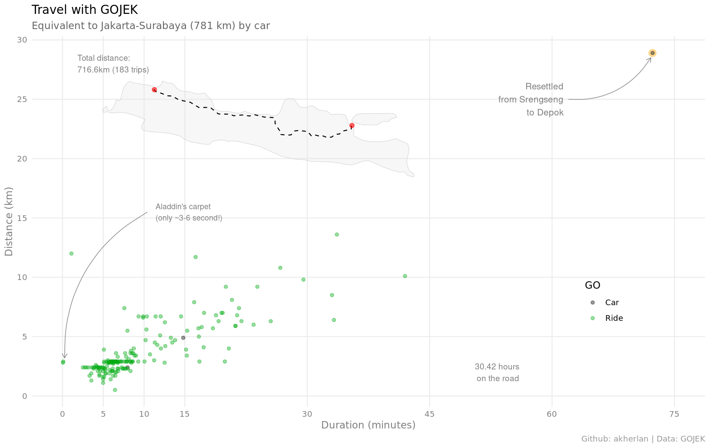
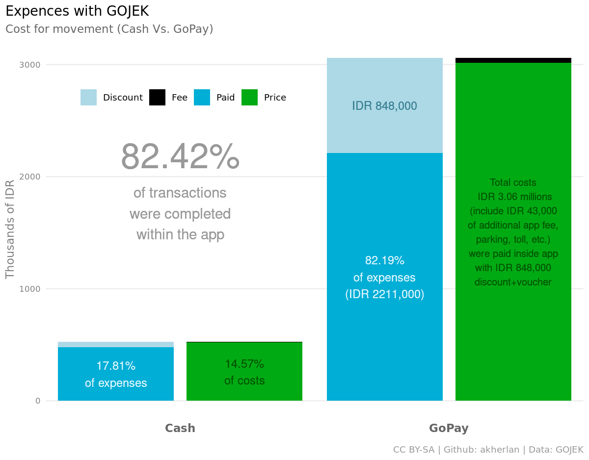

## GOJEK

**Mengolah data invoice dari Gojek**

Data diimpor dari Gmail ke Google Sheets melalui Google Apps Script ([kode](code.gs)), kemudian diekspor ke format csv untuk diolah menggunakan R ([wrangler](1-wrangling.R)).

### Clock

Saya tidak terlalu rutin menggunakan moda transporasi ini. Namun totalnya sudah lebih dari dua hari di jalan sejak 2018 hingga saat ini ditulis.

### Distance

Dengan GOJEK saya sudah melaju seolah-olah mulai dari ujung Barat pulau Jawa hingga ke ujung Timurnya.

### Costs

Biaya ini belum termasuk dengan penggunaan GoBills untuk BPJS, pulsa, dll. apalagi dengan GoFood. Belum.
