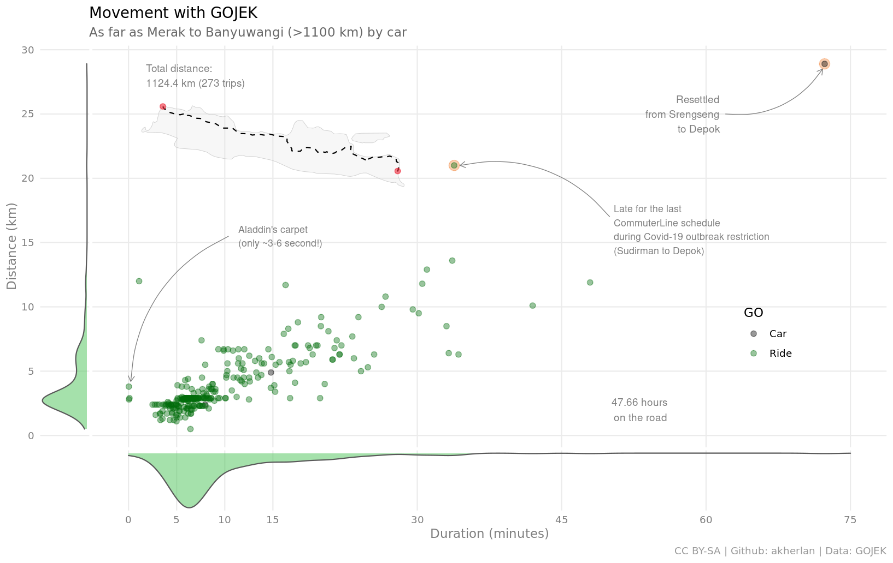

## Travel with Gojek

**Mengolah data invoice dari Gojek**

Data diimpor dari Gmail ke Google Sheets melalui Google Apps Script ([kode](code.gs)), kemudian diekspor ke format csv untuk diolah menggunakan R ([wrangler](1-wrangling.R)).

Proyek personal ini terinspirasi dari [Mas Rasyid Ridha](http://rasyidridha.com/datague/data-gojek/) yang pernah mengolah data Gojek miliknya pribadi.

### Clock

Saya tidak terlalu rutin menggunakan moda transporasi ini. Namun total lama waktu perjalanan saya sudah hampir dua harian terhitung sejak 2018 hingga saat tulisan ini ditulis.

Waktu perjalanan paling sering adalah ketika malam hari antara pukul sembilanan hingga pukul sepuluhan, juga saat pagi menjelang siang.

### Distance

Dengan Gojek saya sudah melaju seolah-olah mulai dari ujung Barat pulau Jawa hingga ke ujung Timurnya. Saya paling sering melakukan perjalanan dengan jarak yang bisa dicapai dalam 5-10 menitan.

Ada saatnya beberapa kali saya menempuh perjalanan yang cukup jauh yaitu ketika terlambat mengejar jadwal kereta terakhir dari Sudirman menuju Depok, juga ketika pindah kosan dari Srengseng Jakarta Barat kembali ke Depok.

Namun ada beberapa data yang "aneh" dan tidak masuk akal karena durasi perjalanan hanya dalam 3-6 detik saja dalam jarak antara 3-5 kilometer.

### Cost

Biaya ini belum termasuk dengan penggunaan GoTagihan (GoBills) untuk BPJS, pulsa, dll. apalagi dengan GoFood. Belum.

### Needs

Perjalanan terbanyak ketika ng-Gojek adalah dari stasiun (atau halte) untuk pulang, disusul oleh perjalanan pulang selepas beraktivitas di luar selain kerja.

Ada hubungan yang erat antara kantor dengan aktivitas transit, dihubungkan dengan aktivitas ng-Gojek.

Jika saya harus menggunakan uang tunai kemungkinan karena saya kehabisan GoPay saat berada di luar rumah.

Pertanyaan berikutnya adalah kenapa ada perjalanan dari rumah ke rumah? Punya rumah lebih dari satu! Hahahaha... Saya pindah-pindah kost sebetulnya.
